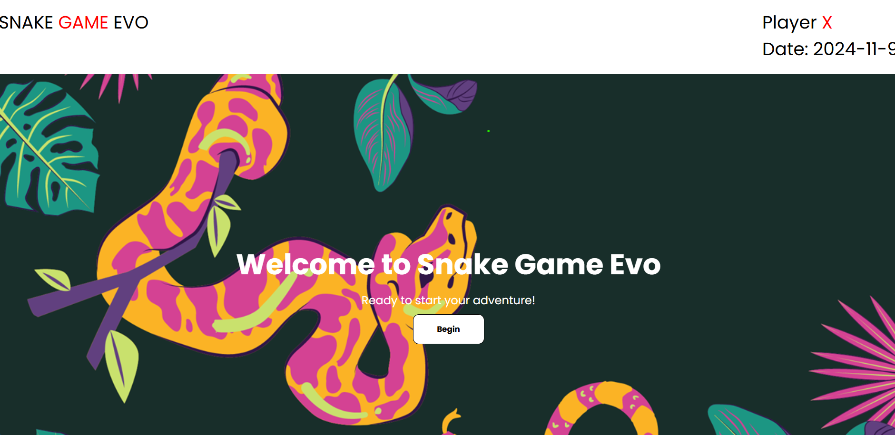
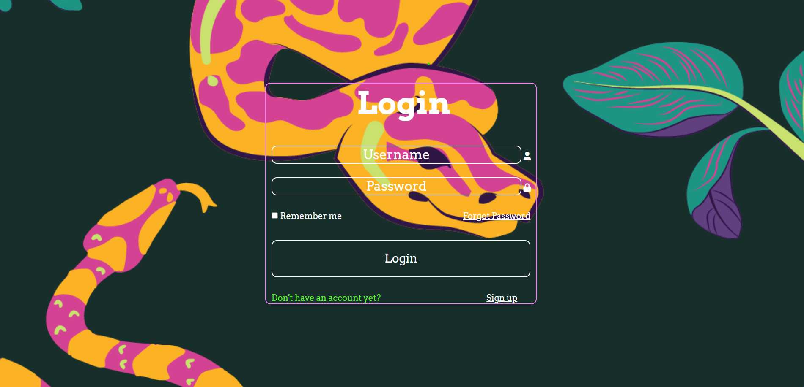
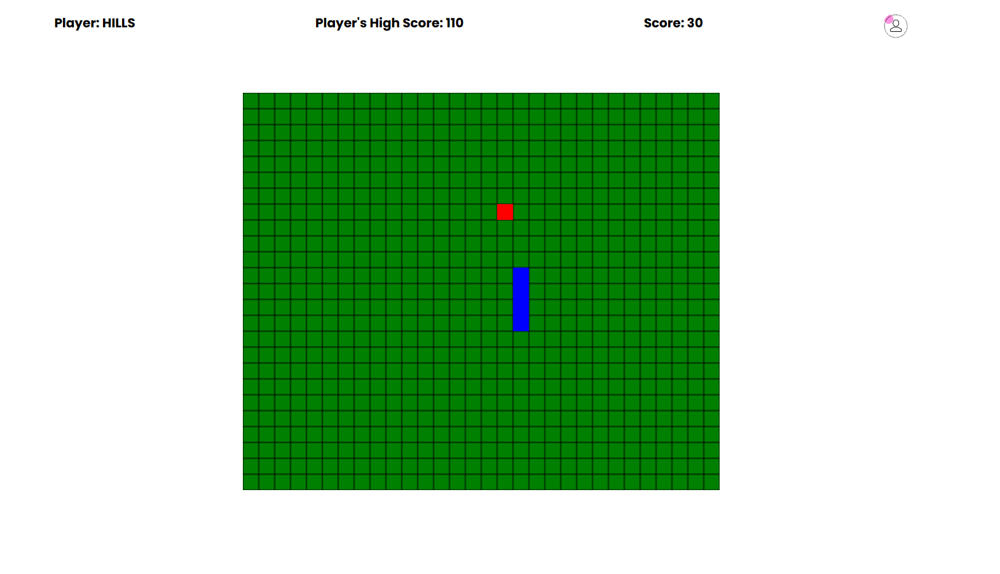

# 🐍 Snake Game Evo 🎮

Welcome to **Snake Game Evo**! A modern twist on the classic snake game with exciting color evolutions and dynamic gameplay. Guide your snake through a grid, collect food, and rack up points while avoiding walls and your own tail.

---

## 🎮 How to Play
- **Movement**: Use the **arrow keys** to control the snake.  
  *(Note: This game works only on a PC).*
- **Objective**: Collect as much food as possible to grow the snake and increase your score.
- **Avoid Obstacles**: The game ends if the snake runs into a wall or its own body.

---

## 🏆 Scoring
- **Each Food Item**: +10 points.
- **Milestones**: Every 100 points, the snake changes to a new color to celebrate your progress!

---

## 🌈 Visual Elements
- **Color Evolution**: The snake’s color changes every 100 points, giving the game a vibrant look as you progress.

---

## 📸 Screenshots & Demo

### 🏠 Homepage
  
*The welcome page to welcome players*

### 🔐 Login Page
  
*Login page where players enter their details.*

### 🏠 Homepage
  
*The main game screen showing the snake and grid.*

### 🎥 Gameplay Video
[Watch how the game is played!](ReadMeassets/demo_video.mp4)  
*A video demo showcasing the gameplay mechanics and visual elements.*

---

## 🔧 Technology Stack
- **Frontend**: HTML, CSS, JavaScript  
- **Styling**: Bootstrap, Google Fonts, FontAwesome icons  
- **Backend**: PHP, MySQL  
- **Development Environment**: XAMPP

---

## 🎯 Can you hit 500 points?  
Jump into the game and see how high you can score. Let the color evolution begin!

---

